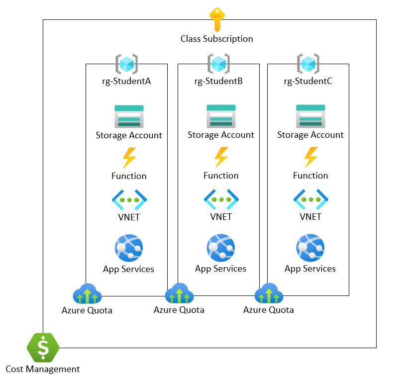

# Azure Classroom framework

This is a framework for using Azure to provide cloud resources for use in classroom.

# Azure Classroom Framework

The Azure Classroom Framework uses a single subscription to provide an Azure environment that can be used by the students of a class. Each student is provided a dedicated resource group where they can deploy Azure resources under the supervision of their instructor. Azure IAM roles are used to provide students access their individual resource groups, while instructors are granted access at the subscription level.

Azure Quotas are applied to each student resource group. These quotas are used to provide alerting capabilities when defined budget thresholds are crossed. Alerts can be sent to the student or the student and instructors.

The diagram below provides a high level overview of the framework using an example with 3 students (Student A, Student B, and Student C) that each have a storage account, Azure Function, VNet, and App Service. 

## Azure Resources

The table below outlines the baseline set of Azure resources contained in an Azure Classroom. Additional resources can be added or made available to individual student resource groups as needed.

| Resource | Purpose |
| --- | --- |
| Azure Subscription | The overall container housing the Azure Classroom resources.  |
| Resource Group | Each resource group contains the individual students resources. |
| Azure Quota | Each resource group is assigned a budget quota for alerting. |
| Cost Management | Azure Cost Management provides the overall budget management. |

## Identity and Access Management

- Built-in Azure roles are used to control the access to resources within the subscription.

### Students

- Limited to the *Contributor* role to their respective resource group.
- May also be granted access to the optional Classroom resource group (role TBD).

### Instructors

- Granted *Co-Owner* role to all student resource groups.
- Granted *Co-Owner* role to the Instructors resource group.
- Granted *Co-Owner* role to the optional Classroom resource group.

## Cost Management

Azure Cost Management provides the mechanism for managing budgets and thresholds for the classroom. Each Student resource group is assigned a budget, as well as the entire subscription. These budgets allow alerting to occur based on instructor defined thresholds. By understanding the expected costs for each classroom module the instructor can determine an estimated cost per student for the course (*student total budget*). Multiplying the *student total budget* by the number of students will provide the budget for the entire course.

*module costs* = estimated costs to complete a course module

*student total budget* = sum of *module costs*

*total course budget* = *student total budget* * number of students + additional resources

Alerts are then created based on: each *module cost*, *student total budget*, and *total course budget*. Cost Management Budgets and Alert Thresholds provide the mechanism to inform both students and instructors of their Azure spending during the course.

Some additional items to consider when considering cost management:

- The [Azure Pricing Calculator]() can assist in estimating costs.
- Learning how to estimate cloud resources can be incorporated into the course curriculum.
- Students can benefit by learning to operate within a defined budget for projects.

### Budgets

- Each *student resource group* is assigned a budget named **b-[id]**, where [id] is the id of the student. This budget should equal the total expected spend by the student for the entire course (*student total budget*).
- The subscription is assigned a budget named **b-[class]**, where [class] is the class name. This budget should equal the total expected spend for the entire course, including any additional resources used for the course (*total course budget*).

### Alert Thresholds

- Budget alerts are created for each Student resource group.
- Each budget alert matches a threshold aligned with the *module costs*.
- Email alerts are sent to the student email address.
- Optionally, the action group ag-instructors, that contains all instructor email addresses, is included in the alert.
